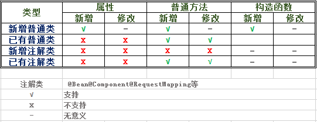

# css-code-loaded
关于代码热加载技术: spring-loaded与spring-boot-devtools
## 一.Spring-Loaded
### 1.工作原理
基于jdk代理方式，实现JVM的Instrumentation进行premain或agentmain代理加载以及TransformerManager的transform方法进行翻译，对增加的class进行listener，对已有class文件内容变化lastModified进行实时Watcher,从而达到JVM的热加载
### 2.Maven配置
```xml
<dependency>
    <groupId>org.springframework</groupId>
	<artifactId>springloaded</artifactId>
    <version>1.2.8.RELEASE</version>
</dependency>
```
### 3.部署方式
**1）Spring-Boot部署方式**
```
java -javaagent://10.100.90.42/Share/Repository/org/springframework/springloaded/1.2.8.RELEASE/springloaded-1.2.8.RELEASE.jar -noverify
```
**2)中间件（Tomcat）部署方式**
```
JAVA_OPTS=%JAVA_OPTS% -javaagent://10.100.90.42/Share/Repository/org/springframework/springloaded/1.2.8.RELEASE/springloaded-1.2.8.RELEASE.jar -noverify
```
### 4.Hotspot支持方式


## 二.spring-boot-devtools
### 1.工作原理
基于服务重启的JVM的jdk代理加载机制，实现class文件或目录进行动态感知监听，从而进行服务重启加载，可以过滤文件或目录是否重新加载到JVM中，从而达到热加载效果
### 2.Maven配置
```xml
<dependency>
    <groupId>org.springframework.boot</groupId>
    <artifactId>spring-boot-devtools</artifactId>
    <optional>true</optional>
    <version>1.5.9.RELEASE</version>
</dependency>
<build>
<plugins>
    <plugin>
	<groupId>org.springframework.boot</groupId>
	<artifactId>spring-boot-maven-plugin</artifactId>
	<configuration>
		<fork>true</fork>
	</configuration>
    </plugin>
</plugins>
</build>
```
### 3.配置（application.yml）
```
spring.devtools.restart.additional-paths: src/main/java
spring.devtools.restart.enabled: true
spring.devtools.restart.exclude: WEB-INF/**
spring.thymeleaf.cache: false
```
